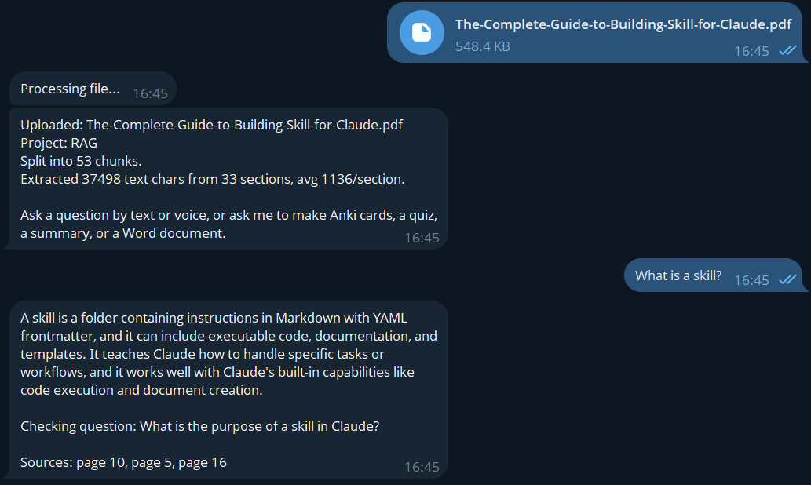
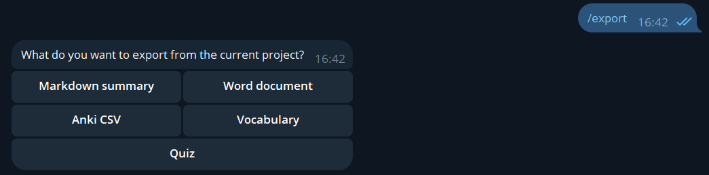
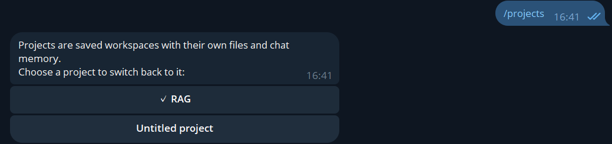
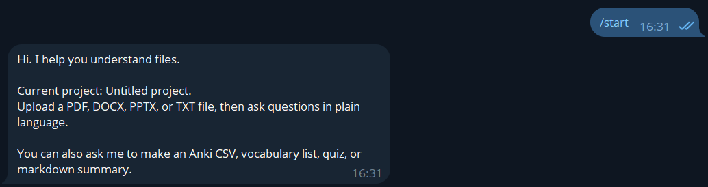
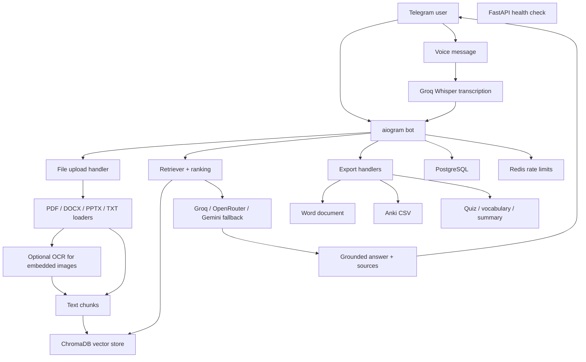

# AI File Companion


A Telegram bot that turns uploaded files into an interactive AI workspace.

Users can upload PDF, DOCX, PPTX, or TXT files, ask questions by text or voice, get answers
grounded in their own documents, generate study materials, export Word documents or Anki
cards, and keep separate projects for different topics.

The original idea was an AI study companion for university students. The current version is
broader: it works as a personal document assistant for technical notes, AI research summaries,
language exercises, presentations, reports, receipt-like files, and other file-based workflows.

## Product Demo

### Screenshots

The current Telegram flow is intentionally command-light: upload a file, ask naturally, and
use projects/exports only when needed.

| File Q&A with sources | Export options |
| --- | --- |
|  |  |

| Project workflow | First-run help |
| --- | --- |
|  |  |

### 1. Technical RAG Notes

```text
User uploads: rag_system_design_notes.pdf

Bot:
Uploaded: rag_system_design_notes.pdf
Project: AI Engineering Notes
Split into 18 chunks.
Extracted 11,420 text chars from 12 sections.

User:
What problem does retrieval-augmented generation solve?

Bot:
Retrieval-augmented generation reduces the chance that an LLM answers only from its
parametric memory. The system first retrieves relevant chunks from an external knowledge
base, then asks the model to answer using that context. This helps with private documents,
fresh information, and source-grounded answers.

Sources: page 2, page 4, page 7
```

### 2. Voice Question Over Uploaded Material

```text
User sends a voice message:
"How is chunking different from embedding?"

Bot:
I heard: How is chunking different from embedding?

Chunking splits a document into smaller passages that can be searched. Embedding converts
each passage into a vector representation so semantically similar text can be retrieved.
In this system, chunking happens before indexing, while embeddings are used by ChromaDB
for retrieval.

Sources: page 3, page 5
```

### 3. OCR-Backed Diagram Question

```text
User uploads: llm_pipeline_slides.pptx

Bot:
Uploaded: llm_pipeline_slides.pptx
Split into 24 chunks.
Extracted 8,900 text chars from 16 sections. OCR read 3 embedded image(s).

User:
What are the stages in the RAG pipeline diagram?

Bot:
The diagram describes this pipeline:

1. File ingestion
2. Text extraction and OCR
3. Chunking
4. Vector indexing
5. Retrieval
6. LLM answer generation
7. Source citation

Sources: slide 6, image OCR 2
```

### 4. Export From A File

```text
User:
Create Anki cards for the key AI terms in this file.

Bot:
Preparing export...
```

```text
User:
Create a Word document summary with the main RAG architecture points.

Bot:
Preparing export...
```

## Why This Project Is Interesting

- It is not a generic chatbot. It answers over user-uploaded files.
- It supports multiple file formats: PDF, DOCX, PPTX, and TXT.
- It can use OCR for embedded images, diagrams, and table-like content.
- It supports text and voice questions in Telegram.
- It uses a multi-provider LLM fallback chain: Groq, OpenRouter, and Gemini.
- It can run retrieval without a paid embedding API by using local hash embeddings.
- It has project workspaces so users can separate different topics.
- It exports useful artifacts: Word documents, Markdown summaries, Anki-style CSV files,
  vocabulary lists, and quiz content.
- It includes tests and a small retrieval eval set instead of relying only on manual testing.

## Features

- Direct Q&A over uploaded documents.
- Telegram voice message transcription through Groq Whisper.
- Source references for generated answers.
- Multiple files per project.
- Saved project workspaces with `/projects`.
- Fresh project flow with `/new`.
- Natural-language export requests.
- OCR for image-based content inside DOCX/PPTX and some document diagrams.
- PostgreSQL persistence for users, projects, documents, quiz results, and knowledge state.
- Redis-backed file upload rate limiting.
- FastAPI health endpoint.

## Tech Stack

- Python 3.11
- aiogram 3
- FastAPI
- LangChain utilities and ChromaDB
- pdfplumber, python-docx, python-pptx, pytesseract
- Groq, OpenRouter, Gemini APIs
- Groq Whisper speech-to-text
- PostgreSQL, SQLAlchemy 2, Alembic
- Redis
- pandas
- Docker Compose
- pytest and ruff

## Architecture



## Quick Start With Docker

Docker is the recommended way to run the project. It starts PostgreSQL, Redis, migrations,
the FastAPI service, and the Telegram bot.

1. Create an environment file:

```powershell
copy .env.example .env
```

2. Fill at least:

```text
BOT_TOKEN=...
GROQ_API_KEY=...
```

Optional but recommended:

```text
OPENROUTER_API_KEY=...
GEMINI_API_KEY=...
```

3. Start the stack:

```powershell
docker compose up --build
```

Useful commands:

```powershell
docker compose ps
docker compose logs -f bot
docker compose logs -f api
Invoke-WebRequest -UseBasicParsing http://localhost:8000/health
```

Run in the background:

```powershell
docker compose up --build -d
```

Stop services:

```powershell
docker compose down
```

Reset containers and volumes during local development:

```powershell
docker compose down -v
```

## Local Development

Docker is still recommended because the app needs PostgreSQL, Redis, Chroma persistence,
and OCR system packages. If those services are already available locally, the Python app can
be run directly:

```powershell
python -m pip install -e ".[dev]"
alembic upgrade head
python -m companion.bot.main
```

Run the API separately:

```powershell
uvicorn companion.api.main:app --reload
```

## Environment Variables

Main variables:

```text
BOT_TOKEN=...

LLM_PROVIDER_CHAIN=groq,openrouter,gemini

GROQ_API_KEY=...
GROQ_MODEL=llama-3.1-8b-instant
GROQ_TRANSCRIPTION_MODEL=whisper-large-v3-turbo

OPENROUTER_API_KEY=...
OPENROUTER_MODEL=meta-llama/llama-3.3-70b-instruct:free

GEMINI_API_KEY=...
GEMINI_MODEL=gemini-2.5-flash-lite
GEMINI_VISION_MODEL=gemini-2.5-flash-lite

DATABASE_URL=postgresql+asyncpg://postgres:postgres@db:5432/study_companion
REDIS_URL=redis://redis:6379/0
CHROMA_PERSIST_DIR=/data/chroma

ENABLE_LOCAL_OCR=true
ENABLE_GEMINI_OCR=true
OCR_MAX_IMAGES_PER_FILE=2

RATE_LIMIT_FILE_UPLOADS_PER_DAY=100
```

Only one working chat provider is enough for basic usage. Multiple providers make the bot
more stable when a free tier is rate-limited.

## Telegram Commands

The public command surface is intentionally small:

- `/start` - intro and first-use guide
- `/help` - short usage help
- `/new` - save/delete the current project and start fresh
- `/projects` - view and switch saved projects
- `/export` - export a summary, Word document, Anki cards, vocabulary, or quiz content

Most actions do not require commands. The intended flow is:

1. Upload a file.
2. Ask a question.
3. Ask for a summary, quiz, Anki cards, vocabulary list, or Word document in natural language.
4. Use `/new` only when switching to a different topic or file set.

## Testing

Run style checks:

```powershell
python -m ruff check src tests scripts
```

Run tests:

```powershell
python -m pytest --tb=short
```

Run retrieval evals:

```powershell
python scripts/run_eval.py --clean
```

The eval set covers:

- AI product requirements
- Ukrainian economics notes
- Psychology notes
- English vocabulary exercises
- Physics motion notes
- Receipt-style documents

It is intentionally small, but it is useful for catching regressions in chunking, retrieval,
source ranking, and language handling.

## API

Health check:

```text
GET /health
```

The API is intentionally minimal right now. Most user-facing functionality lives in the
Telegram bot. User stats are not exposed publicly because they contain per-user learning data.

## Screenshots And Demo GIF

Screenshots are stored in `docs/screenshots/` and show the main Telegram flows:

- `start.png` - first-run bot message.
- `file-and-answer.png` - file upload, chunking, grounded answer, and sources.
- `new.png` - fresh project flow.
- `projects.png` - saved project switcher.
- `export.png` - export format menu.
- `help.png` - command-light usage guide.

## Project Status

Implemented:

- Docker Compose stack
- Telegram polling bot
- PDF/DOCX/PPTX/TXT upload
- OCR for embedded document images
- ChromaDB retrieval
- Local hash embeddings
- Groq/OpenRouter/Gemini chat fallback
- Groq Whisper voice transcription
- Ukrainian/Russian/English response-language handling
- Project creation and switching
- Word/Markdown/Anki/vocabulary/quiz exports
- FastAPI health endpoint
- Tests and retrieval evals

## Engineering Highlights

The project is built around real file-based learning workflows, not a scripted demo:

- Multi-format RAG over PDFs, Word documents, PowerPoint decks, and text files.
- OCR-aware ingestion for diagrams, screenshots, and image-heavy study materials.
- ChromaDB retrieval with lightweight hybrid reranking and source attribution.
- Multi-provider LLM fallback through Groq, OpenRouter, and Gemini for better reliability.
- Voice-to-RAG flow in Telegram using Groq Whisper transcription.
- Project workspaces so users can separate different files, courses, or topics.
- Export generation for Word documents, Markdown summaries, Anki cards, vocabulary lists, and quizzes.
- PostgreSQL persistence with Alembic migrations.
- Redis-backed upload rate limiting.
- Docker Compose setup for bot, API, database, Redis, and migrations.
- Retrieval evals and tests that check behavior across study notes, receipts, English vocabulary, physics, and product docs.

## Future Enhancements

- Add a short product demo GIF.
- Expand project workspace controls for larger personal knowledge bases.
- Improve structured extraction from dense OCR tables and diagrams.
- Add more eval fixtures for language learning, finance, receipts, and AI engineering notes.
- Add optional per-user language settings.
- Add deployment notes for a small VPS.
